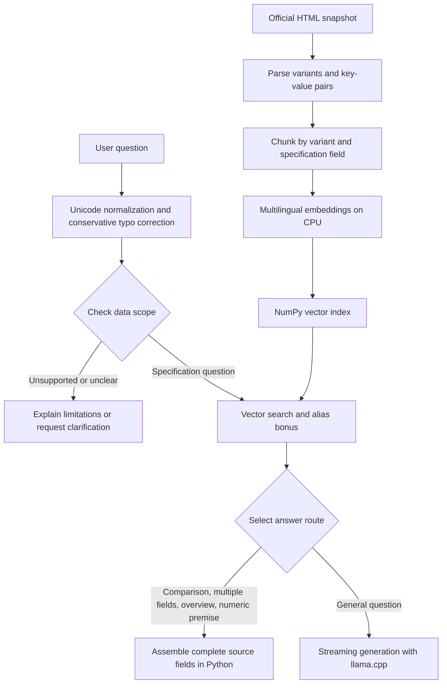

# AORUS MASTER 16 AM6H — Local Product Specification RAG Assistant

A pure Python implementation of specification parsing, chunking, vector retrieval, prompt construction, and answer routing. The project uses `uv` for environment management and `llama-cpp-python` to run a quantized small language model. It supports Traditional Chinese, English, and mixed-language questions about the BZH, BYH, and BXH variants of the AORUS MASTER 16 AM6H.

**Validation status: local CPU functional and regression testing is complete. CUDA performance and 4GB VRAM validation for the current version are pending.** Historical GPU measurements do not establish compliance for the current implementation.

Source: [GIGABYTE official product specifications](https://www.gigabyte.com/tw/Laptop/AORUS-MASTER-16-AM6H/sp). The system uses saved specification data and does not provide live pricing, availability, or measurements absent from the source.

## 1. Quick Start

Use Python 3.11 and install [uv](https://docs.astral.sh/uv/getting-started/installation/) first. Run all commands from the project root. Initial installation and model downloads require internet access. Building `llama-cpp-python` from source requires the platform's C/C++ build tools.

```bash
uv python install 3.11
uv sync --locked --python 3.11

uv run hf download \
  Qwen/Qwen2.5-1.5B-Instruct-GGUF \
  qwen2.5-1.5b-instruct-q4_k_m.gguf \
  --local-dir models

# Build the vector index from data/chunks.json.
# The first run downloads the embedding model.
uv run python -m aorus_rag.embedder

uv run aorus-rag
```

If the models, embedding cache, and matching vector index are already available, run:

```bash
uv run python -m aorus_rag.rag
```

The CLI accepts one question and exits after answering. It has no multi-turn conversation memory. The default is `N_GPU_LAYERS=0`, which runs generation on the CPU.

Example questions, including mixed-language input and a deliberate Chinese typo:

```text
這台 laptop 的 RAM 最大多少？
What GPU does the BYH model use?
BYH 和 BXH 的 GPU 差異？
AORUS MASTER 16 BZH介紹一下
記意體最大多少？
電池可以撐幾小時？
```

The last question asks about battery runtime. The system should explain that runtime measurements are unavailable, rather than infer hours of use from the 99Wh battery capacity.

## 2. Data Preparation and Updates

The project includes `data/specs.json` and `data/chunks.json`. GGUF files and HTML snapshots are excluded by `.gitignore`; download the model separately when obtaining the project from the repository. The HTML snapshot is only required when repeating source parsing.

To update the source, save the official page HTML as `data/aorus_master_16_am6h.html`, then run:

```bash
uv run python -m aorus_rag.scraper
uv run python -m aorus_rag.chunker
uv run python -m aorus_rag.embedder
uv run python -m aorus_rag.evaluate_retrieval
```

The parser first reads `__NUXT_DATA__`, associates variants using `productId`, and extracts values by field title. It falls back to visible-text parsing when structured data is unavailable. The fallback depends on page layout, so verify model associations and values after source updates, even if the commands succeed.

Each variant/specification-field pair becomes one chunk, preserving complete multiline values and notes. The current dataset contains 3 variants × 17 specification categories, or 51 chunks. Rebuild embeddings after any specification or chunk changes. Index loading currently checks record counts only and cannot detect every stale-content mismatch.

## 3. Pipeline



- **Retrieval:** `paraphrase-multilingual-MiniLM-L12-v2` encodes questions and chunks on the CPU. The dot product of normalized vectors gives cosine similarity; matching a category alias adds 0.35. Exhaustive NumPy search is sufficient for 51 records, without a separate vector database.
- **Variant isolation:** Every specification lookup preserves all explicitly requested variants. Deduplicated fields identify the variants to which they actually apply.
- **Structured answers:** Variant comparisons, overviews, multiple categories, and numeric-premise questions use complete source fields to reduce omitted variants, missing notes, and altered numbers. These routes do not call the LLM and are excluded from generation metrics.
- **LLM generation:** General questions receive relevant specifications as context, with instructions to answer from the data in the requested language. With `stream=True`, nonempty text is printed as it arrives. The LLM loads only when generation is first needed.
- **Context budgeting:** The pipeline reserves space for output and the chat template. Oversized contexts use complete source answers instead. Empty generation or an output-length limit also triggers a source fallback.

No LangChain or LlamaIndex is used. Sentence Transformers supplies embeddings; the RAG orchestration is handwritten.

## 4. Model Selection and the 4GB VRAM Target

| Component | Current setting | Rationale |
|---|---|---|
| Generation model | Qwen2.5-1.5B-Instruct GGUF | Small Chinese/English model with product knowledge supplied through retrieval |
| Quantization | Q4_K_M; approximately 1.1GB model file | Reduce weight storage and loading requirements |
| Inference engine | llama-cpp-python | GGUF support with CPU execution and GPU offload |
| Context | 2048 tokens | Bound KV cache and computation requirements |
| Output limit | 256 tokens | Bound individual generation length |
| Batch | 128 | Control inference work-buffer requirements |
| Embedding and retrieval | CPU | Avoid competing with generation for VRAM |
| Generation settings | temperature=0, seed=42 | Improve reproducibility within the same environment |

Model reference: [official Qwen model card](https://huggingface.co/Qwen/Qwen2.5-1.5B-Instruct-GGUF).

**Model file size is not VRAM usage.** GPU memory also includes the KV cache, computation buffers, and CUDA runtime overhead. These settings are resource-control choices, not a measured memory guarantee. The current version still requires GPU measurements covering model loading, first generation, and the benchmark workload.

CPU tests cannot establish NVIDIA GPU speed. Observing less than 4096 MiB on a larger GPU should be reported as sampled usage below the budget; it is not equivalent to testing on a physical 4GB GPU or enforcing a hard VRAM limit.

## 5. Tests and Evaluation Results

```bash
uv run pytest -q
uv run python -m aorus_rag.evaluate_retrieval
uv run python -m aorus_rag.evaluate_robustness
```

The third command runs real local inference and **overwrites** `robustness_results.json`. Back up existing results before switching between CPU and GPU environments so their provenance remains clear.

| Completed local evaluation | Result |
|---|---:|
| Automated tests | 44 tests and 6 subtests passed |
| Original retrieval Top-1 / Top-3 | 18/18 each |
| End-to-end regression checks | 45/45 |
| Cases that actually invoked the LLM | 23 |
| Mean LLM TTFT across those 23 cases | Approximately 0.331 seconds |
| Mean estimated TPS across those 23 cases | Approximately 64.59 tokens/s |
| Current-version GPU performance / VRAM | Pending validation |

Raw answers, routes, retrieved fields, and timings are available in [robustness_results.json](robustness_results.json). This run used `n_gpu_layers=0`. The 45 cases combine 27 robustness cases with the original 18 questions, including repeated questions; they are not 45 independent unseen questions. Averages include the first generation, with no repeated-run statistics or confidence intervals.

Automated tests cover real embedding/index retrieval, variant isolation, typos, input boundaries, refusal behavior, and streaming events. Streaming edge-case tests use a fake engine. The end-to-end evaluation uses the real model, and generated answers were also manually checked against retrieved content.

**45/45 means the regression conditions passed, including required and forbidden substrings. It is not a semantic accuracy score for arbitrary questions.** For example, the Bluetooth question asks whether support exists, not for a version number. The saved report's review note explains why that overly strict scoring condition was corrected.

### Qualitative Analysis

| Observed failure | Change and outcome |
|---|---|
| A BYH question covering multiple specifications included other variants | Preserve variant filters for every category |
| A BYH/BXH comparison mixed GPU specifications and invented performance conclusions | Return both variants' complete GPU fields directly |
| The Chinese typo `記意體` and English typo `memroy` failed retrieval | Normalize common typos before searching |
| A general introduction returned dimensions only | Retrieve all 17 specification categories for an overview |
| Battery runtime was invented as 16 hours | Recognize missing measurement evidence and explain the limitation |
| An instruction attempted to change RAM to 128GB | Reject recognized prompt injection; use source fields for numeric confirmation |
| Maximum supported capacity was presented as installed capacity | Request the sales SKU or order details instead of guessing the shipped configuration |

These changes prioritize correct values and variant associations, at the cost of additional rules and longer source-based answers. An overview currently returns a specification list rather than a short LLM-written introduction.

### Metric Definitions

- `ttft`: Time from the generation call to the first nonempty text fragment, excluding retrieval and model loading.
- `e2e_ttft`: Time from entering `answer_question()` to the first text fragment, including retrieval and any first-time LLM loading. It excludes embedding-model loading during module import.
- `tps`: `(retokenized final-text token count − 1) / (generation end time − first-text time)`. A streaming fragment is not necessarily one token, so this is an approximation rather than an engine-native decoding count.
- `total_time`: Processing time recorded by the function. On the LLM route, it is measured when streaming ends and excludes subsequent source-fallback printing.
- Routes without generation set `used_llm=false`. Zeros in compatibility metric fields are placeholders and are excluded from generation averages.

## 6. Colab / CUDA Validation

Transfer the code, data, and GGUF file to Colab's local disk and rebuild the Linux environment. Do not transfer the Mac `.venv`. The following commands require a selected GPU and CUDA build tools; they have not yet been validated in a Colab run for this revision.

```bash
nvidia-smi
nvcc --version
uv python install 3.11

CMAKE_ARGS="-DGGML_CUDA=on" CMAKE_BUILD_PARALLEL_LEVEL=2 \
uv sync --locked --python 3.11 \
  --no-binary-package llama-cpp-python \
  --reinstall-package llama-cpp-python

uv run --no-sync python -c \
  "from llama_cpp import llama_supports_gpu_offload; assert llama_supports_gpu_offload()"

N_GPU_LAYERS=-1 uv run --no-sync python -c \
  "from aorus_rag.rag import answer_question; answer_question('What GPU does the BYH model use?')"
```

See the [official llama-cpp-python installation instructions](https://github.com/abetlen/llama-cpp-python#installation) for the CUDA build setting. The offload-support check establishes engine capability only; actual GPU use must still be observed. Use `--no-sync` afterward to retain the built environment.

Run the following in one Bash process to sample memory every 100ms, starting before model loading. In Colab, put `%%bash` on the first line of the cell:

```bash
set -e
nvidia-smi --query-gpu=timestamp,index,name,memory.used,memory.total \
  --format=csv -lms 100 > gpu_memory.csv &
monitor_pid=$!
trap 'kill "$monitor_pid" 2>/dev/null || true' EXIT
N_GPU_LAYERS=-1 uv run --no-sync python -m aorus_rag.evaluate_robustness
cp robustness_results.json robustness_results_colab.json
```

Save the GPU model, build versions, test output, JSON report, and `gpu_memory.csv`. These samples measure whole-device usage, may include other processes, and may miss brief peaks. A single screenshot taken after testing does not establish peak usage.

## 7. Known Limitations

- The knowledge base covers only this product family, without live page updates, pricing, game FPS, or battery-runtime measurements.
- Typo correction and scope checks include rules that cannot cover every spelling error, unknown model-code format, paraphrase, or prompt injection.
- General LLM answers stream immediately without a complete output fact-checker, so hallucinations remain possible.
- Requests combining in-scope and out-of-scope questions receive a conservative scope response; the system does not automatically complete every answerable subquestion.
- Direct quotations retain official English content. A Chinese question does not cause every source field to be translated into Chinese.
- An unlisted feature is not necessarily unsupported. Shipped configurations require a complete SKU or sales documentation.
- CPU and historical GPU results do not replace 4GB VRAM validation of the current revision.

## 8. File Guide and Historical Records

| File | Purpose |
|---|---|
| `src/aorus_rag/scraper.py` | HTML specification parsing |
| `src/aorus_rag/chunker.py`, `embedder.py` | Field-based chunking and vector creation |
| `src/aorus_rag/query.py`, `retriever.py` | Normalization, scope checks, and retrieval |
| `src/aorus_rag/rag.py` | Answer routing, context, streaming, and measurements |
| `src/aorus_rag/evaluate_robustness.py` | Current end-to-end regression evaluation |
| `tests/`, `questions.json` | Automated tests and the original 18 questions |
| `pyproject.toml`, `uv.lock` | Dependency configuration and locked versions |

Earlier design notes and CPU/T4 experiments are preserved in the [historical record](docs/historical-results.md). `rag_benchmark_results.csv` and `rag_benchmark_results_gpu.csv` are also historical artifacts. Current routing, output limits, and the TPS formula have changed, so their numbers should not be compared directly.
